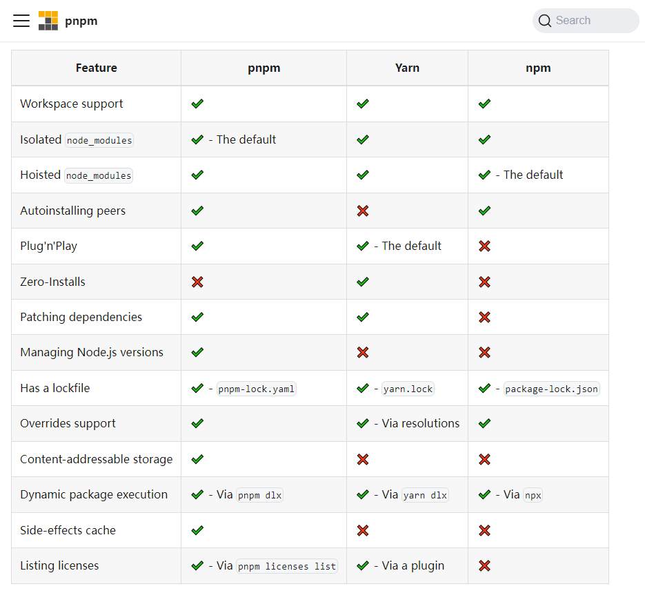

# 实现

## 环境搭建

Vue3 中使用 `pnpm workspace` 来实现 `monorepo`
> pnpm是快速、节省磁盘空间的包管理器。主要采用符号链接的方式管理模块。

## 全局安装

```cmd
npm i pnpm -g
pnpm init -y
```

## 创建 .npmrc 文件

```js
shamefully-hoist = true
```

> 尝试安装 Vue3, pnpm install vue 此时默认情况下 vue3 中依赖的模块不会被提升到node_modules 下。 添加 `shamefully-hoist` 可以将Vue3 所依赖的模块提升到node_modules 中，方便调试源码。

## 配置 workspace
新建 pnpm-workspace.yaml
```js
packages:
  - 'packages/*'
```
> 将 packages 下所有的目录都作为包进行管理。这样 monorepo 就搭建好了。确实比lerna + yarn workspace 更快捷


## 安装依赖

Vue3 采用 rollup 进行打包代码，安装打包所需要的依赖

| 依赖 | 说明 |
| ---  | ---- |
| typescript |	在项目中支持Typescript |
|rollup	| 打包工具|
|rollup-plugin-typescript2	| rollup 和 ts 的桥梁|
|@rollup/plugin-json	| 支持引入 json|
|@rollup/plugin-node-resolve	| 解析 node 第三方模块|
|@rollup/plugin-commonjs	| 将 CommonJS 转化为 ES6Module |
|minimist	| 命令行参数解析|
|execa@4	| 开启子进程|

```cmd
pnpm install typescript rollup rollup-plugin-typescript2 @rollup/plugin-json @rollup/plugin-node-resolve @rollup/plugin-commonjs minimist execa@4 esbuild   -D -w
```

## 初始化 ts

```cmd
pnpm tsc --init
```

> 先添加些常用的 ts-config 配置，后续需要其他的在继续增加

```json
{
  "compilerOptions": {
    "outDir": "dist", // 输出的目录
    "sourceMap": true, // 采用sourcemap
    "target": "es2016", // 目标语法
    "module": "esnext", // 模块格式
    "moduleResolution": "node", // 模块解析方式
    "strict": false, // 严格模式
    "resolveJsonModule": true, // 解析json模块
    "esModuleInterop": true, // 允许通过es6语法引入commonjs模块
    "jsx": "preserve", // jsx 不转义
    "lib": ["esnext", "dom"], // 支持的类库 esnext及dom
  }
}
```

## 创建模块

核心包都放在 packages 目录下管理，先新建两个包

- reactivity 响应式模块
- shared 共相模块

::: code-group

```json [reactivity/package.json]
{
  "name": "@vue/reactivity",
  "version": "1.0.0",
  "main": "index.js",
  "module":"dist/reactivity.esm-bundler.js",
  "unpkg": "dist/reactivity.global.js",
  "buildOptions": {
    "name": "VueReactivity",
    "formats": [
      "esm-bundler",
      "cjs",
      "global"
    ]
  }
}
```


```json [shared/package.json]
{
  "name": "@vue/shared",
  "version": "1.0.0",
  "main": "index.js",
  "module": "dist/shared.esm-bundler.js",
  "buildOptions": {
    "formats": [
      "esm-bundler",
      "cjs"
    ]
  }
}
```
:::

formats 类型
- esm-bundler 在构建工具中使用的格式
- esm-browser 在浏览器中使用的格式
- cjs 在 node 中使用的格式
- global 立即执行函数的格式


reactivity 想要依赖 shared 内部方法，配置 ts 引用关系
```json
{
  "baseUrl": ".",
  "paths": {
    "@vue/*": ["packages/*/src"] 
  }
}
```

## 打包

esbuild 是用 go 语言写的，编译速度快，用于开发时编译。

### 开发环境用 esbuild

::: code-group
```json [package.json]
{
  "scripts": {
    "dev": "node scripts/dev.js reactivity -f global"
  }
}

```

```js [scripts/dev.js]
const { build } = require('esbuild')
const { resolve } = require('path')
const args = require('minimist')(process.argv.slice(2));

const target = args._[0] || 'reactivity';
const format = args.f || 'global';

const pkg = require(resolve(__dirname, `../packages/${target}/package.json`));

const outputFormat = format.startsWith('global')// 输出的格式
  ? 'iife'
  : format === 'cjs'
    ? 'cjs'
    : 'esm'

const outfile = resolve( // 输出的文件
    __dirname,
    `../packages/${target}/dist/${target}.${format}.js`
)

build({
  entryPoints: [resolve(__dirname, `../packages/${target}/src/index.ts`)],
  outfile,
  bundle: true,
  sourcemap: true,
  format: outputFormat,
  globalName: pkg.buildOptions?.name,
  platform: format === 'cjs' ? 'node' : 'browser',
  watch: { // 监控文件变化
    onRebuild(error) {
        if (!error) console.log(`rebuilt~~~~`)
    }
  }
}).then(() => {
    console.log('watching~~~')
})
```
:::

### 生产环境用 rollup

::: code-group
```js [rollup.config.js]
import path from 'path';
// 获取packages目录
const packagesDir = path.resolve(__dirname, 'packages');
// 获取对应的模块
const packageDir = path.resolve(packagesDir, process.env.TARGET);
// 全部以打包目录来解析文件
const resolve = p => path.resolve(packageDir, p);
const pkg = require(resolve('package.json'));
const name = path.basename(packageDir); // 获取包的名字

// 配置打包信息
const outputConfigs = {
  'esm-bundler': {
    file: resolve(`dist/${name}.esm-bundler.js`),
    format: 'es'
  },
  cjs: {
    file: resolve(`dist/${name}.cjs.js`),
    format: 'cjs'
  },
  global: {
    file: resolve(`dist/${name}.global.js`),
    format: 'iife'
  }
}
// 获取formats
const packageFormats = process.env.FORMATS &&  process.env.FORMATS.split(',');
const packageConfigs =  packageFormats || pkg.buildOptions.formats;

import json from '@rollup/plugin-json'
import commonjs from '@rollup/plugin-commonjs';
import {nodeResolve} from '@rollup/plugin-node-resolve'
import tsPlugin from 'rollup-plugin-typescript2'

function createConfig(format,output){
  output.sourcemap = process.env.SOURCE_MAP;
  output.exports = 'named'; 
  let external = []
  if(format === 'global'){ 
    output.name = pkg.buildOptions.name
  }else{ // cjs/esm 不需要打包依赖文件
    external = [...Object.keys(pkg.dependencies || {})]
  }
  return {
    input: resolve('src/index.ts'),
    output,
    external,
    plugins:[
      json(),
      tsPlugin(),
      commonjs(),
      nodeResolve()
    ]
  }
}
// 开始打包
export default packageConfigs.map(format=> createConfig(format,outputConfigs[format]));
```

```js [scripts/build.js]
const fs = require('fs');
const execa = require('execa')
const targets = fs.readdirSync('packages').filter(f => {
  if (!fs.statSync(`packages/${f}`).isDirectory()) {
    return false;
  }
  return true;
});
async function runParallel(source, iteratorFn) {
  const ret = [];
  for (const item of source) {
    const p = Promise.resolve().then(() => iteratorFn(item))
    ret.push(p);
  }
  return Promise.all(ret)
}
async function build(target) {
  await execa(
    'rollup',
    [
      '-c',
      '--environment',
      `TARGET:${target}`
    ],
    { stdio: 'inherit' }
  )
}
runParallel(targets, build)
```
:::
## 补充知识

### pnpm
Fast, disk space efficient package manager
- [Great for monorepos](https://pnpm.io/workspaces)
- pnpm vs yarn vs npm
  


